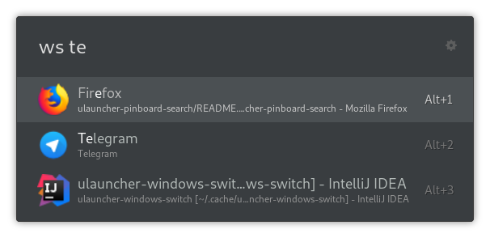

# Ulauncher windows switcher

[Ulauncher](https://ulauncher.io) extension for searching your open windows on X11 and selecting one.

> 
> 
> <a href="https://www.flaticon.com/free-icons/ui" title="ui icons">Ui icons created by riajulislam - Flaticon</a>

## Demo



## Usage

- List your open windows.

```text
ws
```

- List the windows which title or application name match the query term.

```text
ws query
```

## Requirements (Ubuntu|Arch)

- Required system packages ([See post](https://stackoverflow.com/questions/71369726/no-module-named-gi)).
  - wnck3 (`libwnck-3-0` on Ubuntu, `libwnck3` on Arch)

```bash
sudo apt install libcairo2-dev libxt-dev libgirepository1.0-dev libwnck-3-0 python3-gi
```

- `python3-gi` and `gir1.2-wnck-3.0` ([See post](https://stackoverflow.com/questions/43333071/get-wnck-working-with-python-3-5/43349245#43349245)).

```bash
apt-get install python3-gi gir1.2-wnck-3.0
```

## Usefull Commands

- Kill ulauncher

```bash
killall -r ulauncher
```

- Start in development mode.

```bash
ulauncher --no-extensions --dev -v
```

- Print the extension logs ([See post](https://github.com/codyfish/ulauncher-mpd/issues/1#issuecomment-570778716)).

  - Attach mode.

  ```bash
  VERBOSE=1 ULAUNCHER_WS_API=ws://127.0.0.1:5054/com.github.cercedo.ulauncher-windows-switcher PYTHONPATH=/usr/lib/python3/dist-packages /usr/bin/python /home/skylex/.local/share/ulauncher/extensions/com.github.cercedo.ulauncher-windows-switcher/main.py
  ```

  - Single output.

  ```bash
  VERBOSE=1 ULAUNCHER_WS_API=ws://127.0.0.1:5050/com.github.cercedo.ulauncher-windows-switcher PYTHONPATH=/usr/lib/python3/dist-packages /usr/bin/python /home/skylex/.local/share/ulauncher/extensions/com.github.cercedo.ulauncher-windows-switcher/main.py
  ```
